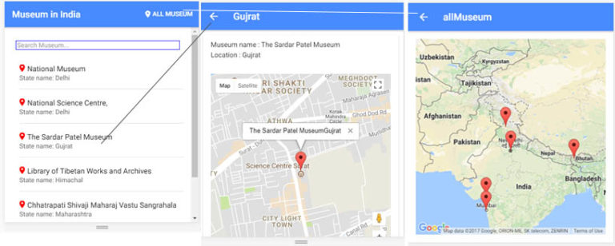
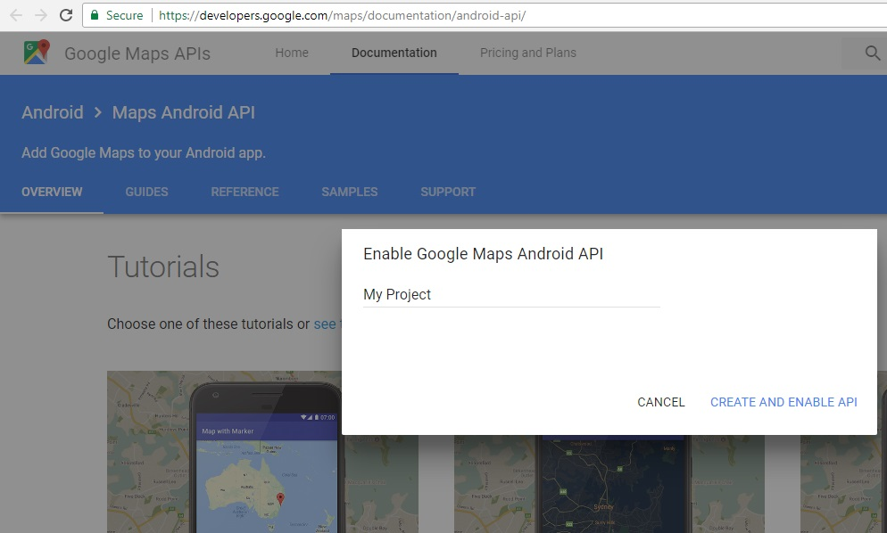
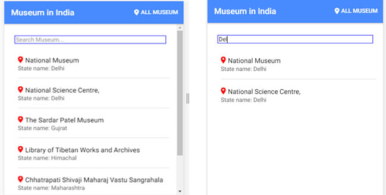

# How to add Google Map and Multiple Marker using Ionic 4
 

In most of the apps, maps are one of the most useful tools for users when included in an app. The Ionic allows us to integrate Google map in our application. We can achieve integrating Google map in Ionic in two-way

* Google Map JS library
* Ionic native SDK map
In this example, we will demonstrate how to use Google Map JS library. We will cover setting up the Google Maps API through the Google Developer Console, displaying a map with multiple markers in your applications, displaying the museum’s location. We are creating an application called museumGoogleMap to demonstrate

What are we learning?

* Displaying individual map for each museum.
* Displaying multiple markers on single Google map.
* Search box to search museum by state.


## STEP 1: SETUP THE PROJECT

```js
ionic start  museumGoogleJsMap  blank --type=angular
```

## Step 2: Setting up Google  Map API in Google Developer Console

In order to use the Google Maps API, you must register your application on the Google Developer Console and enable the API. To do this, start by going to the Google Developer Console for Google JS API. If you already have a project created, you can skip the next section. If not, you can follow along and create a new project for your maps application and then you have to create credentials in Google developer console.

 

On clicking on CREATE AND ENABLE API, you will get API to use Google map in our project and copy the API and the past in our Ionic project **src/theme/index.html** at end of last line in header tag as

```js
<script src="https://maps.googleapis.com/maps/api/js?key=YOURGOOGLEAPI&callback=initMap"
 async defer></script>
 ```
 
## STEP 3: INSTALLING GEOLOCATION PLUGIN
Now we will add the Geolocation plugin, run the following command
```js
>>ionic cordova plugin add cordova-plugin-geolocation
>>npm install @ionic-native/geolocation --save
```

## STEP 4: LET’S BUILD THE APPS, FOLLOWING ALL THE STEPS AS 
We have completed the external configuration, now time to write code for our museum Ionic Apps. We will add two more page.

```js
ionic generate page museum-detail
ionic generate page all-museum
```

In **app.module.ts** file we need to register the provider for Geolocation plugin.

```js
import { NgModule } from '@angular/core';
import { BrowserModule } from '@angular/platform-browser';
import { RouteReuseStrategy } from '@angular/router';

import { IonicModule, IonicRouteStrategy } from '@ionic/angular';
import { SplashScreen } from '@ionic-native/splash-screen/ngx';
import { StatusBar } from '@ionic-native/status-bar/ngx';

import { AppComponent } from './app.component';
import { AppRoutingModule } from './app-routing.module';
import { Geolocation } from '@ionic-native/geolocation/ngx';

@NgModule({
  declarations: [AppComponent],
  entryComponents: [],
  imports: [BrowserModule, IonicModule.forRoot(), AppRoutingModule],
  providers: [
    StatusBar,
    SplashScreen,
    { provide: RouteReuseStrategy, useClass: IonicRouteStrategy },
    Geolocation
  ],
  bootstrap: [AppComponent]
})
export class AppModule {}
```

## CREATING MUSEUM MODEL
Inside app folder create a new folder called models and add the new file for museum model as a **src/models/museum.ts**. Add the following code

```js
export interface Museum{
    name: string;
    state : string;
    latitude: any;
    longitude:any
}
```

## STEP 5: CREATE SERVICES TO SHARED DATA BETWEEN PAGES.
 

Create a folder called service in app folder, as ionic 4 we are sharing data through services. Generate service to share museum data between pages.
>> **ionic generate service museumData**
Run above command in app/service folder and add following file in app/service

```js
import { Injectable } from '@angular/core';
import { Museum } from '../model/museum';

@Injectable({
  providedIn: 'root'
})
export class MuseumDataService {
  museums: [];
  museum: Museum;

  constructor() { }

  setMuseums(data) {
    this.museums = data;
  }

  getMuseums() {
    return this.museums;
  }

  setMuseum(data) {
    this.museum = data;
  }

  getMuseum() {
    return this.museum;
  }
}
```

## STEP 6: ADDING MUSEUM LIST AND SEARCH LIST PAGE
We have to add the list of the museum in **musuem.json** file. In src/assets/data add a new file called **museum.json** file. Add the following museum lists.
```json
{
  "museums": [
      {
        "name": "National Museum",
        "state" : "Delhi",
        "latitude": 28.6117993,
        "longitude": 77.2194934
      },
      {
        "name": "National Science Centre,",
        "state": "Delhi",
        "latitude": 28.6132098,
        "longitude": 77.245437
      },
      {
        "name": "The Sardar Patel Museum",
        "state": "Gujrat",
        "latitude": 21.1699005,
        "longitude": 72.7955734
      },
      {
        "name": "Library of Tibetan Works and Archives",
        "state": "Himachal",
        "latitude": 32.2263696,
        "longitude": 76.325326

      },
      {
        "name": "Chhatrapati Shivaji Maharaj Vastu Sangrahalaya",
        "state": "Maharashtra",
        "latitude": 18.926873,
        "longitude": 72.8326132
      },
      {
        "name": "Namgyal Institute of Tibetology",
        "state": "Sikkim",
        "latitude": 27.315948,
        "longitude": 88.6047829

      }
      ]
}
```
 

In home page we will read a JSON file which contains all the museum and its details. We will use fetch API to retrieve the JSON file content and loads the JSON to a local variable.  We will add search box in our apps to search museum by state name or location name. Modify the following code in **home.page.html**

```html
<ion-header>
  <ion-toolbar>
    <ion-title>Ionic Google map js</ion-title>
    <ion-buttons slot="end">
      <ion-button (click)="allMuseumMap()">
        <ion-icon name="pin"></ion-icon>All Museum
      </ion-button>
    </ion-buttons>
  </ion-toolbar>
</ion-header>

<ion-content>
  <div class="ion-padding">
    <ion-item>
      <ion-label position="floating">Search Mapjs</ion-label>
      <ion-input type="text" placeholder="Search Museum..." (input)="searchMaps($event)"></ion-input>
    </ion-item>

    <ion-list *ngIf="!isfiltered">
      <ion-item *ngFor="let museum of museumData" (click)="getMuseumDetails(museum)">
        <ion-icon name="pin"></ion-icon>{{ museum.name }}
        <p>State name: {{ museum.state }}</p>
      </ion-item>
    </ion-list>

    <ion-list *ngIf="isfiltered">
      <ion-item *ngFor="let museum of filteredMuseum" (click)="getMuseumDetails(museum)">
        <h2>
          <ion-icon name="pin"></ion-icon>{{ museum.name }}
        </h2>
        <p>State name: {{ museum.state }}</p>
      </ion-item>
    </ion-list>
  </div>
</ion-content>
```
In **home.page.ts** modify the following code, as we need to create service to set and get museum data, so that we can shared data between pages.
```
import { Component } from '@angular/core';
import { Router } from '@angular/router';
import { MuseumDataService } from '../services/museum-data.service';

@Component({
  selector: 'app-home',
  templateUrl: 'home.page.html',
  styleUrls: ['home.page.scss'],
})
export class HomePage {
  museumData = [];
  filteredMuseum = [];
  isfiltered: boolean;

  constructor(
    private router: Router,
    private museumSerivice: MuseumDataService,
  ) {
    fetch('./assets/data/museum.json').then(res => res.json())
      .then(data => {
        this.museumData = data.museums;
        this.museumSerivice.setMuseums(this.museumData);
      });
  }

  searchMaps(event) {
    if (event.target.value.length > 2) {
      const filteredJson = this.museumData.filter((row) => {
        if (row.state.indexOf(event.target.value) !== -1) {
          return true;
        } else {
          return false;
        }
      });
      this.isfiltered = true;
      this.filteredMuseum = filteredJson;
    }
  }

  getMuseumDetails(museum) {
    this.museumSerivice.setMuseum(museum);
    this.router.navigate(['/museum-detail']);
  }

  allMuseumMap() {
    this.router.navigate(['/all-museum']);
  }
}
```
Add the following css code in **home.page.scss**

```css
ion-content {
    ion-icon {
        color: red;
        color:red;
        margin:0.8rem 0.5rem 0 0;
    }
    
    input[type=text] {
        border: 1px solid blue;
        height: 2rem;
        padding:0.2rem;
    }
}
```
## Step 6: Adding Mulitple marker on Google Map

We have three-page in this apps, one to display the list of the museum with search methods. This page all-museum is to the display multiple markers on same Google map.  In home page we have a button at the right top most “ALL MUSEUM” on clicking on this button will navigate us to the all-museum page to display all museum in Google map.  Modify the following code **all-museum.page.html**
```html
<ion-header>
  <ion-toolbar>
    <ion-buttons slot="start">
      <ion-back-button></ion-back-button>
    </ion-buttons>
    <ion-title>Museum in India</ion-title>
  </ion-toolbar>
</ion-header>

<ion-content padding>
  <div #map id="map"></div>
</ion-content>
```
Modify the following code in **all-museum.page.ts**

```js
import { Component, OnInit, ViewChild, ElementRef } from '@angular/core';
import { Geolocation } from '@ionic-native/geolocation/ngx';
import { MuseumDataService } from '../services/museum-data.service';
declare var google;

@Component({
  selector: 'app-all-museum',
  templateUrl: './all-museum.page.html',
  styleUrls: ['./all-museum.page.scss'],
})
export class AllMuseumPage implements OnInit {
  @ViewChild('map') mapContainer: ElementRef;
  map: any;
  museumData = [];

  constructor(
    private geolocation: Geolocation,
    private museumSerivice: MuseumDataService) { }

  ngOnInit() {
    this.museumData = this.museumSerivice.getMuseums();
    this.displayGoogleMap();
    this.getMarkers();
  }

  displayGoogleMap() {
    const latLng = new google.maps.LatLng(28.6117993, 77.2194934);

    const mapOptions = {
      center: latLng,
      disableDefaultUI: true,
      zoom: 4,
      mapTypeId: google.maps.MapTypeId.ROADMAP
    };

    this.map = new google.maps.Map(this.mapContainer.nativeElement, mapOptions);
  }

  getMarkers() {
    // tslint:disable-next-line:variable-name
    for (let _i = 0; _i < this.museumData.length; _i++) {
      if (_i > 0) {
        this.addMarkersToMap(this.museumData[_i]);
      }
    }
  }

  addMarkersToMap(museum) {
    const position = new google.maps.LatLng(museum.latitude, museum.longitude);
    const museumMarker = new google.maps.Marker({ position, title: museum.name });
    museumMarker.setMap(this.map);
  }
}
```

Add the following css code **inall-museum.page.scss**

```css
ion-content {
  #map {
      width: 100%;
      height: 100%;
  }
}
```

## STEP 6: DISPLAYING INDIVIDUAL MAP FOR EACH MUSEUM WITH MUSEUM INFORMATION
In **museum-detail.page.html**, we have a list of all the museum and on clicking on each museum we will display Google map for each museum with museum detail information like name of museum and state where it is located.  Modify the **museum-detail.page.html**
```html
<ion-header>
  <ion-toolbar>
    <ion-buttons slot="start">
      <ion-back-button></ion-back-button>
    </ion-buttons>
    <ion-title>{{ museum.state }}</ion-title>
  </ion-toolbar>
</ion-header>

<ion-content>
  <ion-card padding>
    <h3>Museum name : {{ museum.name }}</h3>
    <p>Location : {{ museum.state }}</p>
  </ion-card>
  <div #map id="map"></div>
</ion-content>
```
Modify the following code in **museum-detail.page.ts**
```js
import { Component, OnInit, ElementRef, ViewChild } from '@angular/core';
import { Geolocation } from '@ionic-native/geolocation/ngx';
import { MuseumDataService } from '../services/museum-data.service';
import { Museum } from '../model/museum';
declare var google;

@Component({
  selector: 'app-museum-detail',
  templateUrl: './museum-detail.page.html',
  styleUrls: ['./museum-detail.page.scss'],
})
export class MuseumDetailPage implements OnInit {
  @ViewChild('map') mapContainer: ElementRef;
  map: any;
  museum = {} as Museum;

  constructor(
    private geolocation: Geolocation,
    private museumSerivice: MuseumDataService) { }

  ngOnInit() {
    this.museum = this.museumSerivice.getMuseum();
    this.displayGoogleMap();
  }

  displayGoogleMap() {
    const latLng = new google.maps.LatLng(this.museum.latitude, this.museum.longitude);
    const mapOptions = {
      center: latLng,
      zoom: 15,
      mapTypeId: google.maps.MapTypeId.ROADMAP
    };

    this.map = new google.maps.Map(this.mapContainer.nativeElement, mapOptions);
    const marker = new google.maps.Marker({
      map: this.map,
      animation: google.maps.Animation.DROP,
      position: latLng
    });
    this.addInfoWindow(marker, this.museum.name + this.museum.state);
  }

  addInfoWindow(marker, content) {
    const infoWindow = new google.maps.InfoWindow({
      content
    });
    google.maps.event.addListener(marker, 'click', () => {
      infoWindow.open(this.map, marker);
    });
  }
}
```
Add the following css code in **museum-detail.scss** 
```css
ion-content {
    #map {
        width: 100%;
        height: 100%;
    }
  }
  ```
